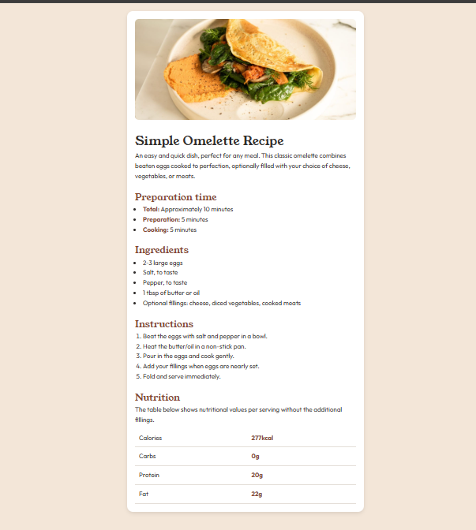

# Frontend Mentor - Recipe Page Solution

This is a solution to the [Recipe Page challenge on Frontend Mentor](https://www.frontendmentor.io/challenges/recipe-page-KiTsR8QQKm).  
Frontend Mentor challenges help you improve your coding skills by building realistic projects.  

## 🚀 Overview

### Screenshot

  

- Live Site URL: [Live Preview](https://ayomide0908.github.io/food-recipe/)

- ### Built with

- Semantic **HTML5**
- **CSS custom properties**

- 👤 Author

Frontend Mentor – @ayomide0908

Twitter – @💭Dev_Bankole
